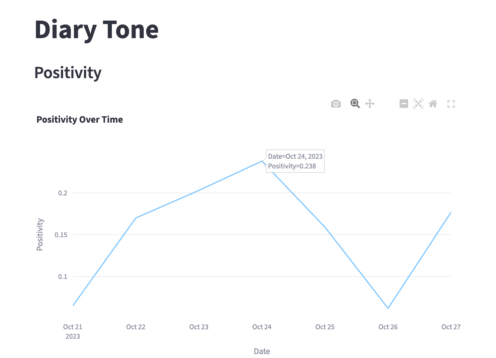
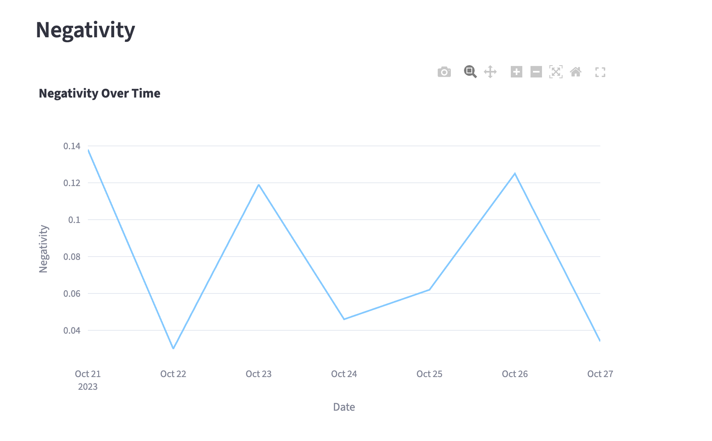

# 📚 NLP Text Analysis with NLTK – Sentiment, Stop Words & Diary Tone Visualizer

This project demonstrates practical applications of **Natural Language Processing (NLP)** using Python's NLTK library. Through hands-on exercises, we analyze the contents of a book and a series of diary entries to extract insights about word usage, sentence mood, and emotional tone over time.

---

## 🚀 Project Features

### 1. **Regular Expressions & Word Frequency**
- Uses the `re` library to extract all words from a book.
- Converts the text to lowercase and counts word frequencies.
- Filters out common **stop words** (articles, pronouns, etc.) using NLTK.
- Displays the **most frequent meaningful words** in the text.

### 2. **Sentiment Analysis (Book & Chapters)**
- Uses `SentimentIntensityAnalyzer` from `nltk.sentiment` to analyze mood.
- Calculates **positivity**, **negativity**, and **compound sentiment** for:
  - A single sentence  
  - The entire book  
  - Each chapter in the book
- Identifies which chapter is most positive or negative.

### 3. **Diary Tone Visualizer (with Streamlit + Plotly)**
- Analyzes a series of diary entries stored in `.txt` files.
- Extracts the **positivity and negativity score** for each entry.
- Visualizes emotional tone over time using **interactive line charts**:
  - Date vs. Positivity
  - Date vs. Negativity

---

## 🛠️ Technologies Used

- **Python 3.11+**
- **NLTK** – Natural Language Toolkit
- **Regular Expressions (`re`)**
- **Streamlit** – to build interactive web app
- **Plotly Express** – for rich, interactive visualizations
- **glob** – to read multiple diary entry files

---


---

## 📊 Sample Output

### ✅ Top Words in the Book (after removing stop words):

```python
[('would', 518), ('us', 411), ('said', 392), ('roberto', 381), ('could', 377)]
````

### ✅ Sentiment Scores for Chapters:

```python
Chapter 1: {'neg': 0.03, 'neu': 0.86, 'pos': 0.11, 'compound': 0.64}
Chapter 5: {'neg': 0.23, 'neu': 0.66, 'pos': 0.11, 'compound': -0.41}
...
```

### ✅ Diary Tone Visualizer:

> 📈 Two line graphs show emotional trends:

## Date vs. Positivity**

## Date vs. Negativity**


---

## 📚 Learning Outcomes

* Real-world applications of **NLP** (sentiment analysis, stop word filtering).
* Understanding of **text processing pipelines** in Python.
* Practical use of **Streamlit** for building lightweight data apps.
* Hands-on with **regex**, **file handling**, and **visual analytics**.

---

## 👨‍💻 Author

**Nishant Ketu**

* 🧠 M.Tech Data Science – IIT Jodhpur
* 💼 Aspiring Data Scientist | ML Engineer
* 🔗 [LinkedIn](https://www.linkedin.com/in/nishant-ketu-388a04152)
* 🐙 [GitHub](https://github.com/ketu363)

---

## 📌 Future Improvements

* Add text classification (topic modeling, spam detection).
* Use spaCy or HuggingFace Transformers for advanced NLP tasks.
* Include real-time diary sentiment via web input.

---

## 🧠 Inspiration

This project is part of a learning journey exploring **NLP with NLTK** through guided video tutorials and interactive coding exercises. It helps bridge theory and real-world applications in sentiment analysis and language understanding.

---


